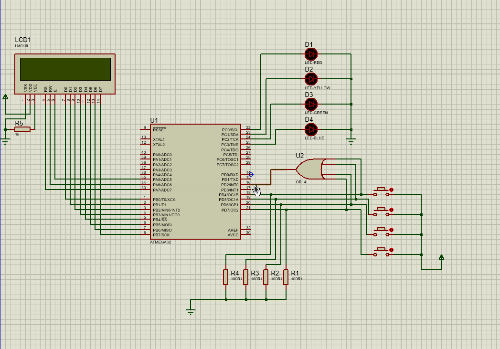

# Simon game
Simon game using atmega32  
simon is a memory game. play online on this link: https://www.memozor.com/simon-games/simon-game    
# Requirement  
* proteus
* atmega32 compiler(atmel studio for example)
# Example
  
# Support:

**Contact me @:**

e-mail: r.abtahi1378@gmail.com

telegram id: @Reyhan_abt

